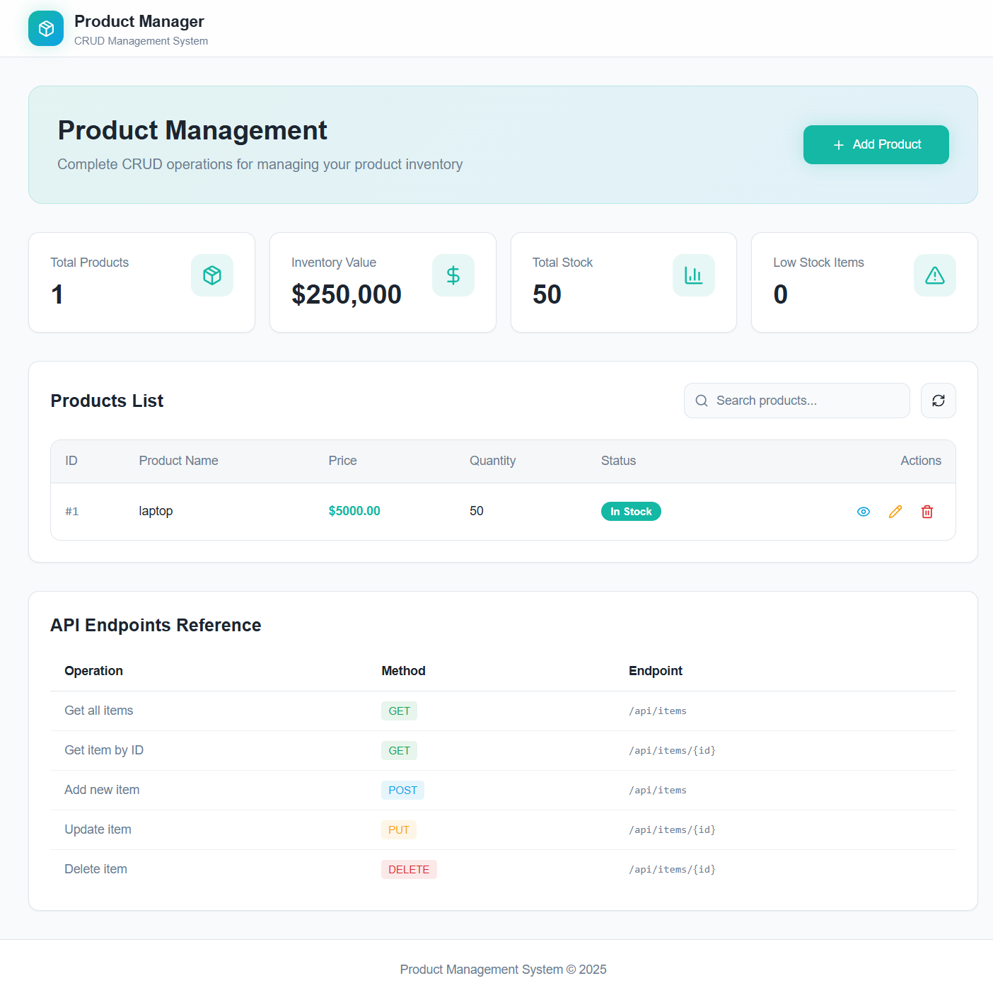
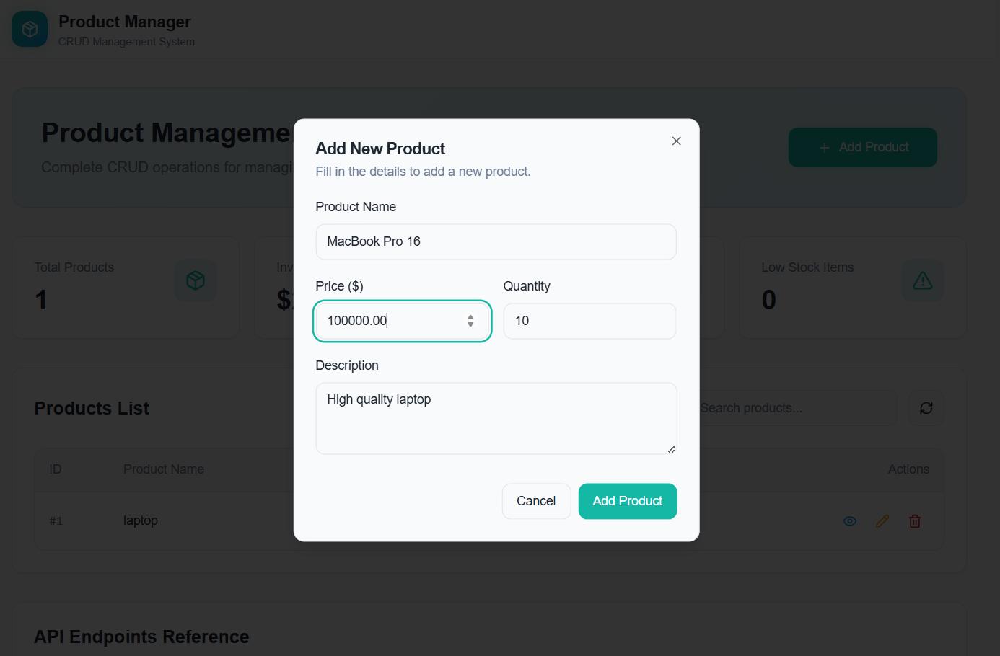
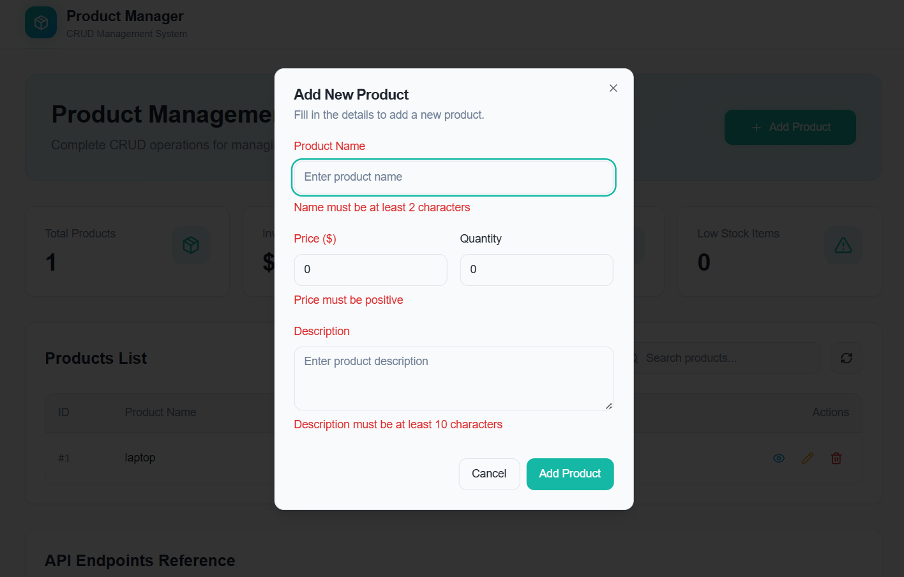
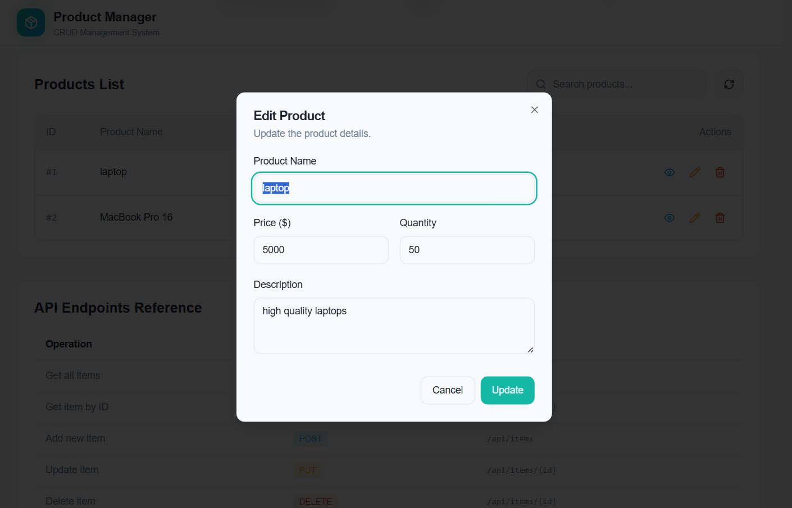
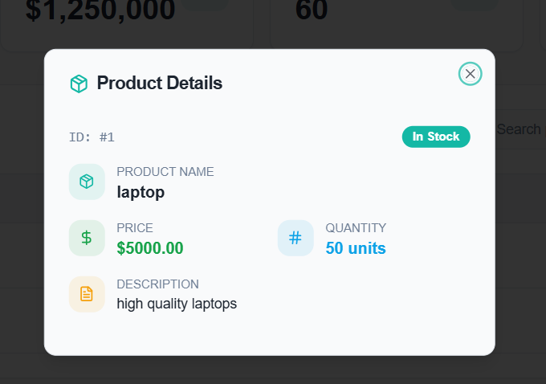
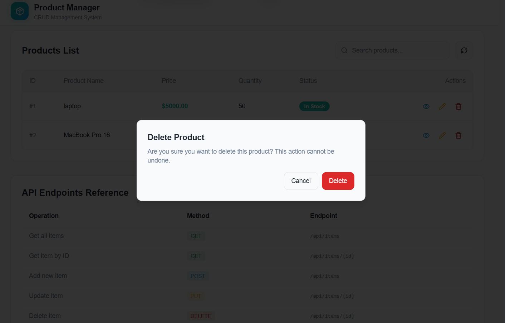
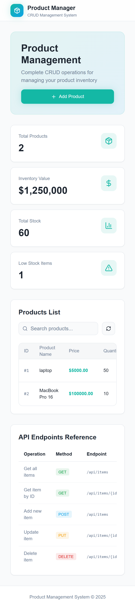
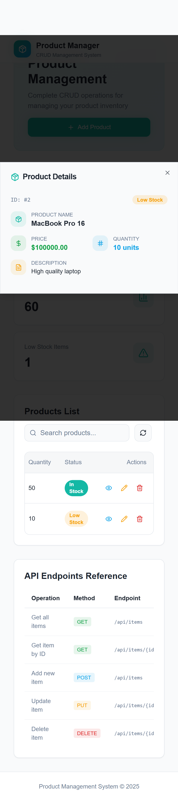

# Fullstack CRUD Assignment - Product Management System

## Candidate Information
**Candidate Name:** Pratiksha Mohan Jadhav
**Assignment Title:** Fullstack CRUD Assignment - Product Management System

## Technology Stack

### Backend
- **Framework:** Spring Boot 3.3.6
- **Language:** Java 17
- **Database:** MySQL
- **ORM:** Spring Data JPA (Hibernate)
- **Build Tool:** Maven
- **Additional Libraries:**
  - Lombok (for reducing boilerplate code)
  - Spring Boot DevTools (for development)
  - MySQL Connector

### Frontend
- **Framework:** React 18.3.1
- **Language:** TypeScript
- **Build Tool:** Vite
- **UI Library:** Radix UI + shadcn/ui components
- **Styling:** Tailwind CSS
- **State Management:** TanStack React Query
- **Form Handling:** React Hook Form with Zod validation
- **Routing:** React Router DOM
- **Icons:** Lucide React

## Project Structure
```
productmanagement/
├── backend/                 # Spring Boot backend
│   ├── src/main/java/com/sate/productmanagement/
│   │   ├── controller/      # REST API controllers
│   │   ├── entity/          # JPA entities
│   │   ├── repository/      # Data repositories
│   │   ├── service/         # Business logic services
│   │   └── exception/       # Custom exceptions
│   ├── src/main/resources/
│   │   └── application.properties
│   └── pom.xml
├── frontend/                # React frontend
│   ├── src/
│   │   ├── components/      # Reusable UI components
│   │   ├── pages/           # Page components
│   │   ├── services/        # API service layer
│   │   ├── hooks/           # Custom React hooks
│   │   ├── types/           # TypeScript type definitions
│   │   └── lib/             # Utility functions
│   ├── package.json
│   └── vite.config.ts
└── README.md
```

## Features
- **CRUD Operations:** Create, Read, Update, Delete products
- **Responsive Design:** Mobile-friendly interface
- **Real-time Updates:** Optimistic updates with React Query
- **Form Validation:** Client-side validation with Zod
- **Modern UI:** Clean, professional interface using shadcn/ui
- **Error Handling:** Comprehensive error handling on both frontend and backend
- **Database Integration:** MySQL database with JPA/Hibernate

## Setup and Installation

### Prerequisites
- Java 17 or higher
- Node.js 18+ and npm/yarn
- MySQL 8.0+
- Git

### Database Setup
1. Install MySQL and create a database:
```sql
CREATE DATABASE product_db;
```

2. Update database credentials in `backend/src/main/resources/application.properties`:
```properties
spring.datasource.url=jdbc:mysql://localhost:3306/product_db?useSSL=false&serverTimezone=UTC
spring.datasource.username=your_username
spring.datasource.password=your_password

# Hibernate configuration
spring.jpa.hibernate.ddl-auto=update
spring.jpa.show-sql=true
spring.jpa.properties.hibernate.dialect=org.hibernate.dialect.MySQLDialect
```

### Backend Setup
1. Navigate to the backend directory:
```bash
cd backend
```

2. Install dependencies and run:
```bash
./mvnw clean install
./mvnw spring-boot:run
```

The backend will start on `http://localhost:9090`

### Frontend Setup
1. Navigate to the frontend directory:
```bash
cd frontend
```

2. Install dependencies:
```bash
npm install
```

3. Start the development server:
```bash
npm run dev
```

The frontend will start on `http://localhost:8081`

## API Endpoints

### Product Management
- `GET /api/items` - Get all products
- `GET /api/items/{id}` - Get product by ID
- `POST /api/items` - Create new product
- `PUT /api/items/{id}` - Update product
- `DELETE /api/items/{id}` - Delete product

### Sample Product JSON
```json
{
  "productName": "Sample Product",
  "description": "Product description",
  "price": 99.99,
  "quantity": 10
}
```

## Running the Application

1. **Start MySQL** service on your system
2. **Run Backend:**
   ```bash
   cd backend
   ./mvnw spring-boot:run
   ```
3. **Run Frontend:**
   ```bash
   cd frontend
   npm run dev
   ```
4. **Access Application:** Open `http://localhost:8081` in your browser

## Build for Production

### Backend
```bash
cd backend
./mvnw clean package
java -jar target/productmanagement-0.0.1-SNAPSHOT.jar
```

### Frontend
```bash
cd frontend
npm run build
npm run preview
```

## Database Schema

### Product Entity
```sql
CREATE TABLE products (
    id BIGINT AUTO_INCREMENT PRIMARY KEY,
    product_name VARCHAR(255) NOT NULL,
    price DOUBLE NOT NULL,
    quantity INT NOT NULL,
    description VARCHAR(500)
);
```

## Assumptions and Design Decisions

1. **Database:** MySQL is used as the primary database with auto-generated tables via Hibernate
2. **API Endpoints:** Using `/api/items` instead of `/api/products` for REST endpoints
3. **Product Fields:** Product entity includes id, productName, price, quantity, and description
4. **Authentication:** No authentication system implemented (can be added as enhancement)
5. **Validation:** Basic validation implemented on both frontend and backend
6. **CORS:** Configured to allow frontend-backend communication during development
7. **Error Handling:** Basic error handling with user-friendly messages

## Limitations

1. **No Authentication/Authorization:** Users can perform all operations without login
2. **No File Upload:** Product images are not supported in current version
3. **No Pagination:** All products are loaded at once (suitable for small datasets)
4. **No Search/Filter:** Basic CRUD operations only
5. **No Unit Tests:** Test cases not implemented in current version

## Pending Enhancements

1. **User Authentication & Authorization**
2. **Product Image Upload & Management**
3. **Advanced Search and Filtering**
4. **Pagination for Large Datasets**
5. **Unit and Integration Tests**
6. **API Documentation with Swagger**
7. **Docker Containerization**
8. **CI/CD Pipeline Setup**
9. **Caching Implementation**
10. **Audit Logging**

## Troubleshooting

### Common Issues

1. **Database Connection Error:**
   - Ensure MySQL is running
   - Verify database credentials in application.properties
   - Check if database `product_db` exists

2. **Port Already in Use:**
   - **Backend Port Conflict**: If you get "Port already in use" error:
     ```bash
     # Find process using the port (replace 9090 with your port)
     netstat -ano | findstr :9090
     
     # Kill the process (replace PID with actual process ID)
     taskkill /PID <PID> /F
     ```
   - **Alternative**: Change port in `application.properties`:
     ```properties
     server.port=9091
     ```
     Then update frontend service URL in `frontend/src/services/productService.ts`:
     ```typescript
     const API_BASE_URL = 'http://localhost:9091/api/items';
     ```
   - **Frontend**: Vite will automatically suggest alternative port

3. **CORS Issues:**
   - Ensure backend CORS configuration allows frontend origin
   - Check if both servers are running on expected ports

## Screenshots

### Desktop Interface

#### Dashboard - Product Listing

*Main dashboard showing product inventory with CRUD operations*

#### Add New Product

*Form for adding new products with validation*

#### Add Product Validation

*Form validation in action showing error messages*

#### Edit Product

*Edit form with pre-populated data*

#### Product Details

*Detailed view of individual product*

#### Delete Product Confirmation

*Delete confirmation dialog for product removal*

### Mobile Responsive Design

#### Mobile Dashboard

*Responsive design optimized for mobile devices*

#### Mobile View

*Mobile interface showing responsive layout*

## Testing

### Manual Testing
1. **Create Product:** Test adding new products with valid data
2. **Read Products:** Verify all products are displayed correctly
3. **Update Product:** Test editing existing product information
4. **Delete Product:** Test product deletion functionality
5. **Validation:** Test form validation with invalid data
6. **Responsive Design:** Test on different screen sizes

### API Testing
You can test the API endpoints using tools like Postman or curl:

```bash
# Get all products
curl -X GET http://localhost:9090/api/items

# Create a new product
curl -X POST http://localhost:9090/api/items \
  -H "Content-Type: application/json" \
  -d '{"productName":"Test Product","price":29.99,"quantity":5,"description":"Test description"}'
```

## Performance Considerations

- **Database Indexing:** Primary key indexing on product ID
- **Query Optimization:** Using Spring Data JPA for efficient database operations
- **Frontend Optimization:** React Query for caching and optimistic updates
- **Bundle Size:** Optimized with Vite for fast loading

## Security Considerations

- **Input Validation:** Both client-side and server-side validation
- **SQL Injection Prevention:** Using JPA/Hibernate parameterized queries
- **CORS Configuration:** Properly configured for development environment
- **Data Sanitization:** Basic input sanitization implemented

## Contact
For any questions or issues, please contact: 
008pratiksha@gmail.com

---
**Submission Date:** December 2024  
**Repository:** https://github.com/Jadhavpree/fullstack-crud-assignment